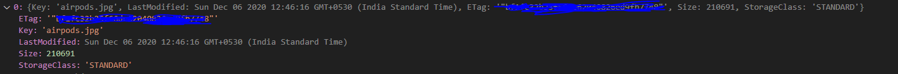

Recently I have been making calls to AWS serices using API, so one such thing I wanted to was try to get the objects from AWS bucket. I am not an AWS expert, I am just trying to see how to make this work. As we know AWS is not so great with Documentation and their API sucks, so after doing some research by searching on Stackoverflow and medium, I found a simple way to Get Objects from AWS bucket using Node js. So for achieving this task we will be using AWS SDK for Node JS.

### Get Objects From AWS S3 Bucket with NodeJS

To get started you will need to install aws-sdk library. Use the below command to do so.

> npm install aws-sdk

OR

> npm i aws-sdk.

Since I use Node latest version I will use npm -i aws-sdk.

We will need a **config.json** file to store our credential like secret key and access key or region.

Source code can be found below. Since this is anonymous function to run this, you can type F5 in your VS code and select Node.js as your environment to execute this code for you.

Additionally you can also integrate this functionality and expose it as an API so for example if your frontend wants to access the resources they can make a GET request to the endpoint you define and you will get your Response.

    const config = require("./config.json");
    const aws = require("aws-sdk");

    (async function () {
    try {
    aws.config.setPromisesDependency();
    aws.config.update({
    accessKeyId: config.aws.accessKey,
    secretAccessKey: config.aws.secretKey,
    region: config.aws.region,
    });

    const s3 = new aws.S3();
    const response = await s3
      .listObjectsV2({
        Bucket: "your aws bucket name",
      })
      .promise();
    console.log(response.Contents);

    } catch (err) {
    console.log(err);
    }
    })();

Do share it or Tweet it if you find this helpful.
